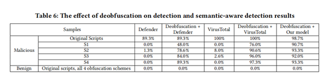

# Effective and Light-Weight Deobfuscation and Semantic-Aware Attack Detection for PowerShell Scripts

## ABSTRACT

作者的贡献：

- 因为PowerShell语言在设计上是动态的，并且可以在不同层级构建脚本片段，因此固有的基于静态分析的PowerShell攻击检测方法容易被模糊。故而作者为PowerShell脚本设计了第一个有效的轻量级去模糊方法。为了解决精确识别可恢复脚本片段的挑战，作者设计了一种新型的基于子树的去模糊方法，该方法在PowerShell脚本的抽象语法树中的子树层级上执行模糊检测和基于仿真的恢复。
- 基于新的反模糊方法，作者设计了第一个语义感知的PowerShell攻击检测系统。为了启用基于语义的检测，作者使用经典的面向对象的关联（OOA）挖掘算法来获取PowerShell攻击签名，并基于恶意的PowerShell脚本数据库的集合新识别31种针对PowerShell攻击的OOA规则。
- 基于6483个PowerShell脚本示例（2342个良性脚本和4141个恶意示例）的集合，发现作者的去模糊方法不仅有效，而且模糊后的脚本和原始脚本之间的相似度从仅0.5％提高到80％左右，同时效率也高，对于平均大小为5.4 KB的脚本，平均花费不到0.5秒。通过应用模糊处理Windows Defender和VirusTotal的攻击检测率从0.3％和2.65％大幅提高到75.0％和90.0％。此外，作者的语义感知攻击检测系统的的真实阳性率平均为92.3％，错误阳性率平均为0％，优于Windows XP Defender和VirusTotal。  

## INTRODUCTION

对具有代表性的脚本去模糊方法在模糊检测准确性、恢复质量和开销方面进行比较，结果如表1所示。

##          **BACKGROUND AND MOTIVATION**

### **“Living Off the Land” and Fileless Attacks via PowerShell**

- “逃离陆地”攻击是指丢弃尽可能少的文件并且仅使用干净的系统工具来避免被检测到的攻击。
- 无文件攻击是指避免在磁盘上留下任何痕迹的攻击。  

PowerShell是进行此类攻击的理想工具，原因如下：

- 自Windows 7和Windows Server 2008 R2起，PowerShell已预安装在所有Windows计算机上。因此，目前恶意的PowerShell脚本可以危害几乎所有Windows系统下的计算机。  

- 作为功能强大的第一方管理工具，PowerShell可以轻松访问所有的Windows主要组件，包括Windows Management Instrumentation（WMI）和Component Object Model（COM），它们可以直接触发许多特权系统级操作。  

- PowerShell脚本可以直接从内存执行，而无需任何形式的隔离，因此可以避免磁盘上的恶意文件并绕过传统的基于文件的防御方法。  

  
### Obfuscation Techniques for PowerShell

 模糊技术是逃避检测的常用方法，对于PowerShell，为了隐藏恶意意图并避免被发现，攻击者经常利用PowerShell的动态特性来创建高度模糊的脚本。如图1所示，可以在运行时构造脚本。  

从逻辑上讲，执行模糊脚本的过程可以分为两个步骤：

- 计算可以在脚本中扮演多个角色的字符串。

- 重构原始脚本并执行它们。对于token的重建，这两个步骤是混合在一起的。作者分析了Symantec白皮书中常用的模糊处理技术，并在以下三个类别进行讨论：

  -  随机化。随机模糊是一种技术，攻击者可以在不影响脚本执行和语义的情况下对脚本进行随机更改。这些技术包括空格随机化，大小写随机化，变量和函数名称随机化以及Power Shell忽略的插入字符。这些技术的优势在于，PowerShell解释器对某些脚本属性不敏感，例如不区分大小写。图1（c）中的变量“ $ Random”是这种模糊的一个示例。这种模糊只会影响阅读，而不会影响语义和语法。  

  - 字符串操作。为了模糊处理Power Shell中的字符串，有多种方法，例如字符串拆分，字符串反转和字符串重新排序，它们引用图1（c）中计算的变量“ $ StrReorder”，“ $ Strjoint”和“ $ Url”。  

  - 编码。基于编码的模糊处理是现实世界中最常见的模糊处理技术。编码后，模糊处理后的脚本会反映原始脚本的少量信息。图1（b）中的变量“ $ SecstringEncoding”显示了如何在模糊中使用编码。

### **Effectiveness of Obfuscation on PowerShell Attack Detection Today**  

作者选择了五个具有代表性的模糊处理方案，这些模糊处理方案在不同的构建级别上使用了不同的模糊处理技术和编码方法，如表2所示。  

- 实验方法：作为一种基本的模糊处理技术，在这五个方案都应用了随机化。对于方案S1和S2，分别在标签层级和脚本块级别采用字符串操作。对于方案S3和S4，应用基于编码的模糊处理，该模糊在脚本块级别使用。作者为它们选择两种类型的编码技术，即基于安全字符串的编码和基于十六进制的编码，分别表示带有秘密密钥的编码和没有秘密密钥的编码。对于方案S5，作者应用基于AST的模糊处理。  

- PowerShell脚本样本 :作者从开源网站和安全博客中收集了75个恶意样本，并从Github收集了相同数量的良性样本。然后使用上述5种方案对这150个脚本中的每个脚本进行模糊处理。随后，作者将原始脚本和模糊后的脚本上传到VirusTotal，该网站汇聚了多达70种最新的防病毒产品并提供在线扫描。从扫描结果中，计算报告恶意软件警报的的数量。

- 实验结果。实验结果如图2所示。

## OVERVIEW

作者首先设计了一种机制将其作为开发第一个语义感知PowerShell攻击检测系统的关键构建块。如图3所示，检测过程可以分为三个阶段：  

- 去模糊阶段。作者构建AST子树并对子树进行恢复，最后构造去模糊的脚本。
- 训练和检测阶段。作者在恶意PowerShell脚本数据库上采用了经典的面向对象的关联（OOA）挖掘算法。此外，还可以将现有的防病毒引擎和手动分析作为扩展。
- 应用场景。作者的方法具有更高的代码覆盖率，更低的开销，并且不需要修改系统或解释器，而且模糊处理更加有弹性，并且更具解释性。凭借这些优势可以将其部署在实时攻击检测、大规模自动化恶意软件分析中。
## POWERSHELL DEOBFUSCATION
### Subtree-based Deobfuscation Approach Overview

图4显示了基于子树的去模糊处理的总体过程。从总体上讲，去模糊处理可以分为五个阶段。  

1. 将PowerShell脚本样本解析为AST，然后提取子树。  

2. 找到带有分类器的模糊子树/片段。注意,并非所有满足模糊特征的树都是可恢复的子树，以下两种情况模糊片段和可回复片段不一致：
   - 可恢复片段可以是模糊片段的一部分  
   - 模糊片段可以是可恢复片段的一部分 
   
3. 用仿真器恢复模糊的片段，以获得原始脚本片段。  
4. 将经过模糊处理的片段解析为新的AST，并替换经过模糊处理的子树。这样的过程循环直到没有剩余的模糊子树为止。  
5. 重新构建脚本片段以获得去模糊的脚本。然后，使用后处理模块删除脚本在模糊过程中添加的一些冗余结构 。
### Extract Suspicious Subtrees

为了解析PowerShell脚本并获取AST，作者采用了Microsoft的官方库。PowerShell的AST总共有71种类型的节点，解析器返回的根类型为ScriptBlockAst的AST。  

需要检查两种类型的子树，PipelineAst类型的子树或AssignmentStatementAst节点下的第二个子树。作者将这两种类型的子树称为可疑子树。如图5和图6所示，红色块表示PipelineAst节点，蓝色块表示AssignmentStatementAst节点。

### Subtree-based Obfuscation Detection

- 特征选择：

  - 脚本片段的熵。熵表示字符频率的统计特征。在大多数情况下，有两种流行的模糊技术可能会严重影响熵：所有变量和函数名称的随机化以及编码。熵的计算公式如下：

    ​    

  - 标签的长度。几乎所有类型的模糊技术都会更改令牌的长度，作者选择标签的平均长度和最大长度作为特征。  
  - AST类型的分布 。在模糊过程中，通常会更改某些节点类型的节点数。因此，作者计算了每种节点类型的节点数，并构建一个71维向量作为特征。    
  - AST的深度。几乎所有模糊技术都会对AST的深度和总节点数产生重大影响。因此，作者还使用AST深度和总节点数作为特征。  

### Emulation-based Recovery

如果脚本片段是可恢复的脚本片段，则此过程的返回值为恢复的脚本片段。如果返回值不是字符串，则表示最后一步的模糊检测结果错误，或者当前脚本段不是可恢复段。对于这两种情况，作者将子树标记为非模糊子树，然后继续进行下一个模糊子树。

### AST Update

获得可恢复片段后将其解析为新的AST（恢复的子树）并更新AST。

- 用恢复的子树替换可恢复的子树。相应地，应该更新其所有祖先的功能，并将恢复的子树中的所有可疑子树推入堆栈。

- 更新脚本片段的更改。

### Post processing

作者使用后处理模块删除脚本在模糊过程中添加的一些冗余结构 ，其去模糊方法对示例脚本及其AST的总体效果如图7所示，最终的去模糊脚本几乎与原始脚本相同。

## SEMANTIC-AWARE POWERSHELL ATTACK DETECTION

如表3所示，PowerShell语言中的API包含更高级别的语义，因此在作者的系统设计中，采用API集而不是图形进行PowerShell语义检测。  

如图8所示，作者的检测系统可以分为两个阶段：训练和检测 

### Training Phase

利用解析器获得AST节点，提取值并进行标准化：

- 转换为小写字母；
- 删除无关的字符；
- 检查别名。

获得OOA规则需要两个步骤。

- 使用FP-growth算法生成频率模式。

- 选择满足规则的模式，这些规则的支持度和置信度得分大于用户指定的最小值。规则的支持度和置信度得分定义如下：  

  

### Detection Phase

作者将去模糊的脚本解析为项目集，并尝试匹配之前训练的OOA规则。结果不仅能显示恶意分数，还能显示脚本的语义。  

## EVALUATION

## Evaluation Methodology

- 基于子树的去模糊处理的性能

  - 是否可以找到模糊中涉及的最小子树 

  - 比较去模糊脚本和原始脚本之间的相似性来验证整个去模糊的质量，通过以下公式计算两个子树之间的相似度。

    

  - 计算利用不同模糊方法对模糊脚本进行去模糊处理所需的平均时间，来评估去模糊的效率  

- 去模糊方法对PowerShell攻击检测的好处  

### Evaluation Results

-  模糊检测的准确性：结果显示在表4中，如图所示，在测试集上，作者的方法可以实现100％的真阳性率（TPR），假阳性率低至1.8％。相比之下，PSDEM仅具有49.9％的真实阳性率（FPR），因为它在所有被S3和S4模糊的样本上均失败。同时，它的误报率是22.2％，远高于作者的方法。  

  

- 恢复质量：作者比较去模糊前后的模糊样本脚本与原始脚本之间的相似性，从而评估总体恢复质量。结果示于表5。  

  

- 去模糊效率：图9显示了对一个模糊脚本进行去模糊处理所需的平均时间。  

  

- 基于模糊脚本的攻击检测：表6显示了去模糊处理对检测的影响，模糊处理可以有效地绕过检测。  

  

- 与最新的PowerShell检测方法的比较。作者应用了基于AST和基于字符的功能进行检测，并选择效果最好的分类器 ，结果示于表7。

  

- 作者用于去模糊处理技术的分解分析。作者一次删除或替换了一个主要技术，然后评估对性能的影响，结果示于表8。

  

## DISCUSSION

### Generality of Our Approach

只要模糊是通过将脚本片段隐藏为字符串来覆盖语义，作者的方法就可以应用，实现有效的去模糊处理。树的更新策略和最终构造去模糊吹脚本的策略是可重用的，故而若构建一个新语言的去模糊系统所需的唯一额外工作就是收集模糊子树的样本并训练模糊检测器。去模糊的脚本可以与现有的静态检测系统一起使用，以获得更好的检测结果。

### Possible Evasion Attacks

- 反调试
- 逻辑模糊处理

## RELVATED WORK
### Script-based Malware Detection

如表9所示，脚本语言的恶意软件检测方法可以分为三类:

- 动态检测
- 静态检测
- 模糊检测

### Deobfuscation Approaches

- 二进制的去模糊处理技术。基于签名的方法在可执行文件中搜索已知的打包程序，但是无法检测到新的包装器。通过控制流和别名分析来定位转换点，并通过向后切片来提取拆包逻辑或提取自包含的变换函数的混合方法。来确定存储隐藏代码的正确时刻。  

- 脚本的去模糊处理技术，见上文。    

## CONLUSION

应用作者的去模糊处理后，Windows Defender和VirusTotal的攻击检测率从0.3％和2.65％大幅提高到75.0％ 90.0％。此外，作者的语义感知攻击检测系统的真阳性率和假阳性率平均分别为92.3%和0%，优于Windows Defender和Virustotal。这可以为现有的检测系统提供很多帮助，其误报率的降低与检测率的提高可以很好的应用于用户和研究人员。   