# αDiff

------

作者：BingChang Liu等   

单位：中科院信息工程院，清华大学网络科学与网络空间学院

出处：ASE

资料：Paper

------

## 1.Abstract & Introduction

二进制代码相似性检测BCSD有很多应用，比如补丁分析，剽窃检测，恶意软件检测等等。
通常，现有的解决办法都是根据专家经验，通过从二进制代码里提取的特定的句法特征来进行比较。
这种方法大多要么表现开销大要么检测准确率低。并且，很少有办法能在跨版本（？）的二进制代码之间检测相似性。

BCSD：比较两个二进制函数

困难：
1.不同编译器优化设置优化出来不同的跨优化二进制码
2.不同算法的编译器，不同的跨编译器二进制码
3.不同机器上编译的，跨架构二进制码

State-of-the-art BCSD（最先进的）解决方案重度依赖二进制码的某种特定的句法特征（比如，函数的控制流程图CFG)
比如最常用的BinDiff用GI算法，很耗时。抗CFG变化很脆弱，检测准确率低。很少有算法考虑语义的。

作者则提出了αDiff这种方法，用三种语义特征，来解决跨版本BCSD的问题。
首先，用一种深度神经网络DNN对每一个二进制函数提取一个intra-function特征（内函数特征）
DNN直接对原始字节加工，而不是用由专家提供的特征。
进一步，αDiff分析每一个二进制代码的函数调用图，并且提取内函数和内模块特征。
然后，用这三个特征计算一个距离。

the function code’s (i.e.,intra-function) features 函数内
专家知识先入为主，原始的二进制字节可以提取出不带偏见导向的特征。
具体将原始字节提取成矩阵，再用卷积神经网络(CNN)将之转换成一个嵌入（比如矢量）。
进一步，保证相似的函数嵌入彼此接近，将CNN嵌入到一个*Siamese*网络（很受欢迎的用来细粒度的视觉相似度识别的网络）

 function invocation (i.e., inter-function)features 函数之间
考虑到相似的函数有相似的函数调用图，通过这个来提取特征。
理想情况下，考虑全部的调用。
为了性能，只考虑一个函数节点在图中的入度和出度。

module interactions (i.e., inter-module) features 模块之间
考虑到相似的函数有相似的引入函数。分析各个引入函数集，提取模块特征。

作者已经实现了一个原型，并且用250万的数据集测试过了。结果表明，比业内最先进的（BinDiff）的都好百分之十。

**作者做出的贡献**：

1.提出了一种用于从原始二进制函数字节中提取函数内语义特征的神经网络解决方案，不需要专家知识。
与其他两种特征一起，共同构建了一个端对端的用于跨版本BCSD的系统αDiff。
2.搭建了一个标签过的深度学习数据集，包含66823对二进制码和大约250W对函数。研究者可以免费使用，用于构建其他的神经网络。
3.搭建了αDiff的一个原型，用上面的数据集进行了评估。比业内最先进的要好。

## 2.PROBLEM DEFINITION

### 2.1	Notation and Assumption（注释和假设）

假设所有二进制码由高级语言的源码编译而来，而不是手写的汇编代码或者由packer产生的（增加混淆）。
debug符号被去除。增加分析难度。

假设二进制码中的一系列函数能够被正确识别。
如果某两个函数名字一样，用于的语境一样，就可以匹配。

### 2.2 Cross-version BCSD Problem

所谓跨版本问题，就是指分析两份由同一个源码项目编译出来的二进制码B1和B2，这两份会随着时间不断变化。
（1）函数匹配：对B1当中的每一个函数f1i找到B2中对应的匹配f2i.
（2）相似度得分：对每一对f1和f2，计算一个相似度。
（3）区分标识：相当于不相似度。

### 2.3 Variant BCSD Problems

之前提到的3个困难。

### 2.4 评估标准

B1 = f11, f12, ..., f1n
B2 = f21, f22, ..., f2m
假设有T对匹配函数i.e., (f11, f21), (f12, f22), ..., and (f1T , f2T )，其他的不匹配
挑前K个最相似的函数topK(f1i ),定义hit@K(f1i )

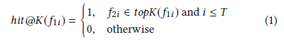

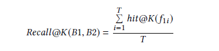

## 3 方法

### 3.1总览

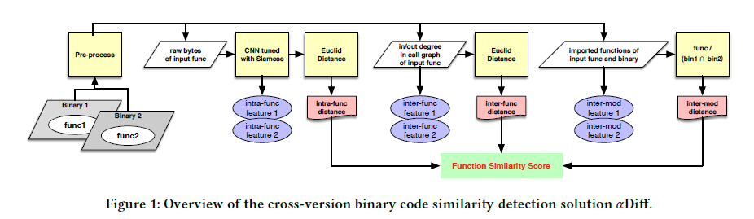

### 3.2 函数内语义特征

函数原始二进制字节作为输入Iq，映射到嵌入f (Iq)（比如一个D维向量），嵌入可用于计算两个函数的欧式距离。
训练模型满足RQ：相似函数间距离小，反之大。
由深度度量学习所启发，在Siamese架构中嵌入两个CNN，用来服从RQ和训练CNN的参数。

#### 3.2.1 用CNN映射函数嵌入

典型的CNN通常是用于图像分类的，比如RGB，这不适合，故设计新的CNN:

网络结构。这个CNN包括8个卷积层，8个normalization层，4个最大pooling层，2个全连接层。整个模型采用矫正线性
单元作为非线性激活函数。这个模型里总共有超过160W参数。

网络I/O。这个CNN输入是100×100×1的张量T，输出是64维的向量（嵌入）。将函数的原始字节逐字节填入T中。不够补0或者丢弃。

数据增强。不采用任何数据增强措施。破坏语义。

过拟合问题。采用batch normalization。

#### 3.2.2用Siamese网络学习参数

见图2.Siamese用两个相同的CNN嵌入网络。每个CNN接受一个输入，输出对应的嵌入。

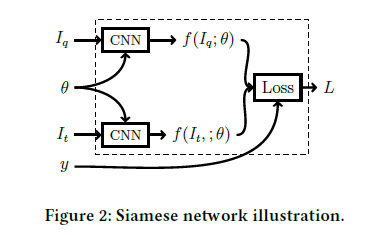

f代表网络结构，θ表示网络参数。
此外，还接受一个输入参数y，表明两个函数是否相似。相似为1，反之为0。

训练就是为了找到最合适的θ来满足RQ。

正式来讲距离计算：

为了达到上面的目的，做了一个比较损失函数。	

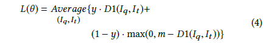

这个函数值要最小，D1(Iq, It ) is close to 0 when y = 1, and max(0,m − D1(Iq, It )) is
close to 0 when y = 0.

综上，训练就是要找到合适的θ让L最小。可用随机梯度下降法，使用标准BP算法。

#### 3.2.3 阴性训练样本

选择难度适当的错误回复。（看不懂）

http://www.shuang0420.com/2018/03/17/%E6%89%AF%E6%89%AF%20Semi-hard%20Negative%20Samples/

### 3.3函数间语义特征

函数不可能单独工作。相互关系可以提取为一个特征。用函数调用图。为了性能只算一个函数节点的入度和出度，将函数间语义特征嵌入到一个2维向量中。

比较两个函数的特征。（距离）

### 3.4模块间语义特征

一个函数通常援引一系列引入函数，记为mp(Iq)，这些在外部模块中的定义（比如库）。注意到相似的函数通常会引入相似的函数。并且，即使函数跨版本，其所引用的函数集也相对比较稳定。故可作为一个特征。

保持一致，选择特征转换为向量方便计算。

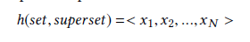

公式中，N是superset的个数，xi=1如果superset的第i个元素在set里，反之为0。

对某两个函数Iq 和 It，假设包含他们的二进制码分别为Bq 和 Bt，距离计算公式如下：

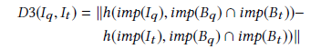

### 3.5总体相似度计算

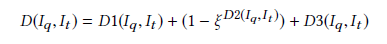

## 4 评估

### 4.1 实现

作者已经实现了一个原型，由三个部分组成：预处理器，特征产生器，神经网络模型。

预处理器是作为IDA Pro的插件实现的。对每一个函数，提取三类信息：
原始字节，调用图中的出度和入度，引入函数集。

这三类原始信息之后会被编码成嵌入，如第三节中那样。

### 4.2 评估设置

数据集 Github和Debian两个来源，对多个项目并且对同一个项目找了多个版本。每一个二进制码找最近的版本配对。

数据集分类 分三类，分别用于训练，验证和测试。4：1：1

神经网络训练 在CNN模型中用RMSProp optimizer，具体参数见论文。

### 4.3 Siamese网络中的超参数

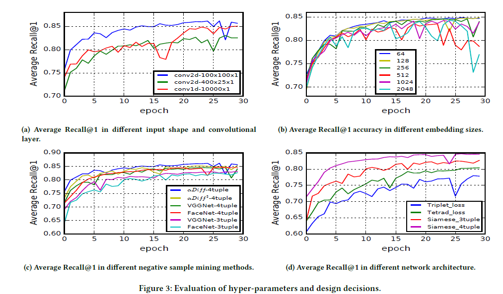

recall=TP/(TP+FN)=TP/P=sensitive

### 4.4 跨版本BCSD准确性评估

对测试集评估

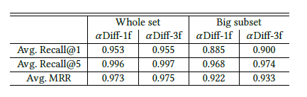

将测试集分为大子集和小子集。

MRR：MRR（Mean reciprocal rank）是一个国际上通用的对搜索算法进行评价的机制，即第一个结果匹配，分数为1，第二个匹配分数为0.5，第n个匹配分数为1/n，如果没有匹配的句子分数为0。最终的分数为所有得分之和

**对于一个query，若第一个正确答案排在第n位，则MRR得分就是 1/n 。**

对coreutils评估

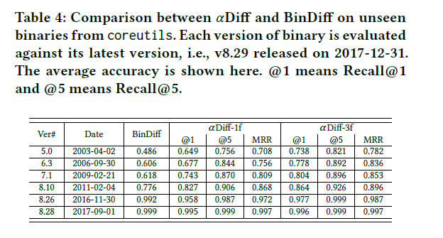

### 4.5 跨编译器BCSD的表现

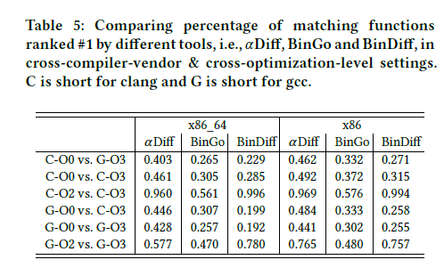

不同编译器编译的，不同工具找出的排名第一的配对函数的所占比例

### 4.6 跨架构的BCSD表现

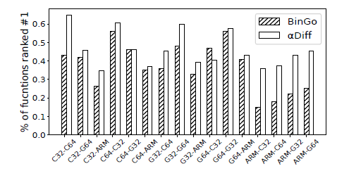

不同构架下的。

## 5 讨论

作者用CNN将函数的原始字节编码成一个嵌入。通过2维的CNN将函数当成一个2维的表格。
2维CNN通常用于图形处理，似乎1维更合适于处理类似于文本的函数。但在评测中，特定配置过的2维CNN要比1维表现更好。
作者目前无法解释这个原因，准备日后在神经网络可视化的工作中进一步探索。至少这个研究展现了2维CNN提取特征的可行性。
尽管αDiff 在跨构架的表现上胜过BinGo，但在评估中还是函数间和模块间特征发挥了重要作用。未来作者打算用跨平台的数据集来训练模型。

## 6 总结

本文作者提出了一个深度神经网络增强方案αDiff来解决跨版本的BCSD问题。利用了三个语义特征，函数内，函数间，模块间，都是从原始字节中提取的特征。
实现了一个原型，并在数据集上进行了测试。结果发现αDiff比目前业内最先进的静态解决方案平均表现好百分之10.

## 7  思考

专家知识会导致先入为主，抛弃先验知识可能会有更准确的结果。

从不同方面由局部到整体，由小到大考虑特征分析。比如函数内，函数间，模块间。

能否把专家知识也囊括进去，做一个更为全面的分析？比如加权考虑。

